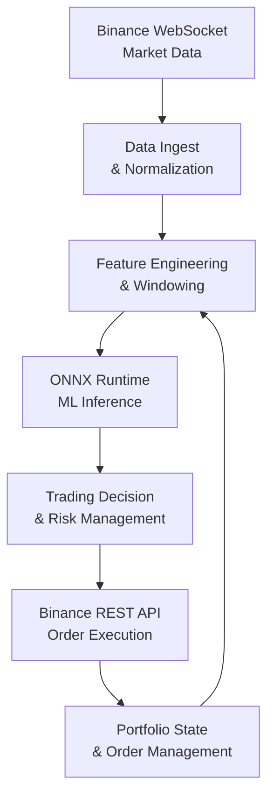

# Binance Trading Bot with Rust & ONNX

This project is a real‑time cryptocurrency trading bot that streams data from Binance, performs feature engineering, runs an ONNX machine learning model, and executes trades based on the model's predictions. The core is written in Rust for maximum performance and low latency.

## 🏗️ System Architecture

The bot is structured as a single Rust application with several logical components:



## 📁 Project Structure

The project is organized as follows:

binance_trading_bot/
├── Cargo.toml # Rust manifest: dependencies, metadata, build config
├── Cargo.lock # Lockfile for exact dependency versions (tracked for executables)
├── .gitignore # Specifies intentionally untracked files
├── .env.example # Example environment variables (rename to .env for real keys)
├── Dockerfile # Multi-stage build for containerized execution
├── docker-compose.yml # Docker Compose configuration for easy container management
├── README.md # This documentation
└── src/
└── main.rs # Main Rust source code: WebSocket streaming + argument handling

### Key Files Explained

- **`Cargo.toml`** – Defines the package name, version, and dependencies (e.g., `tokio`, `tokio-tungstenite`, `chrono`).
- **`Cargo.lock`** – Ensures reproducible builds by locking dependency versions. Tracked in git because this is a binary crate.
- **`.env.example`** – Template for environment variables. Copy to `.env` and fill in your Binance API keys when you add trading logic.
- **`Dockerfile`** – Builds a minimal container image using a multi-stage build.
- **`docker-compose.yml`** – Simplifies running the container with configurable stream types via an environment variable.
- **`src/main.rs`** – The heart of the application: connects to Binance WebSocket, parses messages, and prints formatted data based on the chosen stream (`trade`, `m5`, `m15`).

This structure keeps everything organized and ready for future extensions (e.g., adding feature engineering modules, model inference, trading logic).

### 1. Data Ingestion (Current Implementation)

- **Purpose:** Connect to Binance WebSocket streams (trades, candlesticks) and receive real‑time market data.
- **Implementation:** `tokio-tungstenite` for async WebSocket handling. Raw JSON messages are parsed and converted into strongly‑typed Rust structs.
- **Current features:**
  - Supports `trade`, `m5` (5‑minute klines), and `m15` (15‑minute klines) streams via command‑line argument.
  - Displays human‑readable timestamps using the `chrono` crate.

### 2. Feature Engineering (Planned)

- **Purpose:** Transform raw market data into the input features required by the ML model. This is a critical step that must be extremely fast and deterministic.
- **Implementation options:**
  - **Custom Rust code:** Use `ndarray` or `nalgebra` to compute technical indicators (SMA, RSI, order book imbalance) with full control over memory and performance.
  - **Polars DataFrame:** For more complex aggregations, the [Polars](https://github.com/pola-rs/polars) crate can be integrated to handle windowed operations efficiently.
- **Key considerations:**
  - All feature computation must be **lock‑free** and avoid allocations on the hot path.
  - The output is a fixed‑size vector (or tensor) that matches the ONNX model's input shape.

### 3. ML Inference with ONNX Runtime (Planned)

- **Purpose:** Run the trained model to generate trading signals.
- **Implementation:** [ort](https://crates.io/crates/ort) – a safe Rust wrapper for ONNX Runtime.
- **Workflow:**
  1. Load the model (`model.onnx`) once at startup.
  2. For every new feature vector, call `model.run()`.
  3. The output is a tensor containing e.g., a probability score or a class label (BUY/SELL/HOLD).
- **Performance:** Inference is performed synchronously within the main event loop – no network calls, no garbage collection pauses.

### 4. Trading Decision & Risk Management (Planned)

- **Purpose:** Decide whether to act on the ML signal, and if so, how.
- **Logic:**
  - Convert raw model output into an order type and size (e.g., if score > 0.8, buy 0.001 BTC).
  - Apply risk checks:
    - Maximum position size
    - Daily loss limits
    - Cooldown periods after trades
    - Market sanity checks (spread, volatility)
- **Implementation:** Custom Rust state machine, possibly using a lightweight actor model.

### 5. Order Execution (Planned)

- **Purpose:** Send authenticated orders to Binance.
- **Implementation:** Use a library like [ccxt‑rust](https://crates.io/crates/ccxt-rust) or [crypto‑botters](https://crates.io/crates/crypto-botters) to interact with Binance REST API.
- **Handling:**
  - Manage API key/secret securely (environment variables).
  - Implement retry logic with exponential backoff.
  - Track order status and update portfolio state.

### 6. Portfolio & Order Management (Planned)

- **Purpose:** Maintain an up‑to‑date view of balances, open orders, and positions.
- **Implementation:** In‑memory state that is updated on every trade and periodically synced with Binance.

## 🚀 Getting Started

### Prerequisites

- Rust (edition 2021) – if you want to build locally.
- Docker (optional) – for containerized execution.

### Installation (Local)

1. Clone the repository:

   ```bash
   git clone https://github.com/yourname/binance_trading_bot.git
   cd binance_trading_bot
   ```

2. Build the project:

   ```bash
   cargo build --release
   ```

### Usage

Run the streamer with a chosen stream type:

```bash
# Live trade data (default)
cargo run

# or explicitly
cargo run trade

# 5‑minute candlesticks
cargo run m5

# 15‑minute candlesticks
cargo run m15
```

Example output:

```
Trade | Time: 2025-03-21 14:32:17.456 UTC | Price: 65432.10 | Qty: 0.001
Kline | CloseTime: 2025-03-21 14:35:00.000 UTC | Open: 65400.00 | High: 65450.00 | Low: 65380.00 | Close: 65430.00 | Volume: 12.5
```

### Docker

You can also run the application inside a Docker container. This ensures a consistent environment and simplifies deployment.

#### Build the image

```bash
docker build -t binance-streamer .
```

#### Run the container

```bash
# Default trade stream
docker run --rm binance-streamer

# 5‑minute candles
docker run --rm binance-streamer m5

# 15‑minute candles
docker run --rm binance-streamer m15
```

#### Using docker-compose

A `docker-compose.yml` file is provided for convenience:

```yaml
version: '3.8'

services:
  binance-streamer:
    build: .
    image: binance-streamer:latest
    container_name: binance-streamer
    restart: unless-stopped
    # Uncomment to override the default command
    # command: ["m5"]
    environment:
      - TZ=UTC
```

Start it with:

```bash
docker-compose up
# or detached mode
docker-compose up -d
```

Stop and remove:

```bash
docker-compose down
```

## 🧪 Development Roadmap

- [x] WebSocket streaming from Binance (trades, 5m, 15m) with readable timestamps
- [x] Docker containerization
- [ ] Add more streams (order book, klines for other intervals)
- [ ] Implement feature engineering (technical indicators)
- [ ] Integrate ONNX Runtime for inference
- [ ] Build decision engine with risk management
- [ ] Add order execution (testnet first)
- [ ] Live paper trading mode
- [ ] Real‑money trading with safeguards

## ⚠️ Risk Disclaimer

Trading cryptocurrencies carries significant risk. This software is for educational purposes only. Use at your own risk. Always test thoroughly on testnet before using real funds.

## 📚 Dependencies

- `tokio` – async runtime
- `tokio-tungstenite` – WebSocket client (with `rustls-tls` or `native-tls`)
- `serde_json` – JSON parsing
- `chrono` – human‑readable timestamps
- `url` – URL parsing
- `futures-util` – stream utilities
- `ort` – ONNX Runtime bindings (future)
- `polars` – DataFrame operations (optional)
- `ccxt‑rust` – Exchange connectivity (future)

```

This README now reflects all the recent enhancements. Feel free to tweak any sections to better match your project's specifics.
