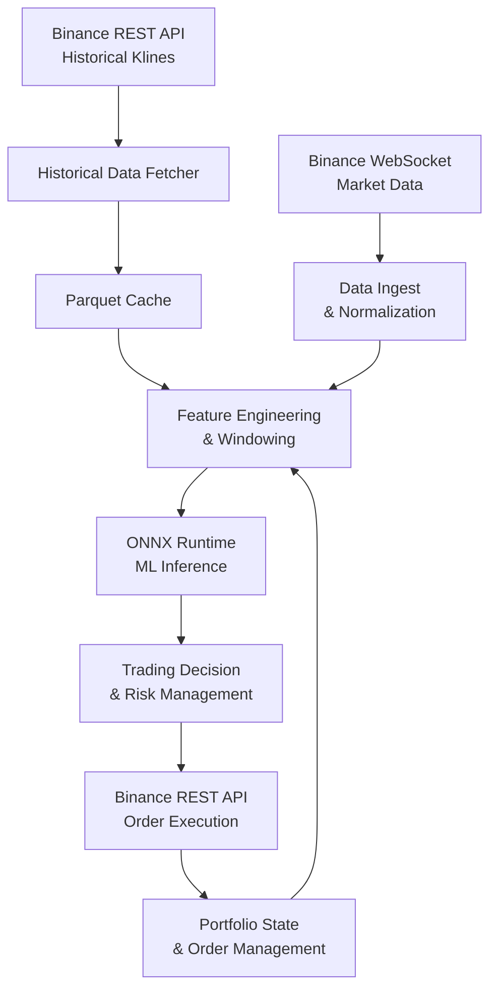

# Binance Trading Bot with Rust & ONNX

This project is a real‑time cryptocurrency trading bot that streams data from Binance, performs feature engineering, runs an ONNX machine learning model, and executes trades based on the model's predictions. The core is written in Rust for maximum performance and low latency.

## ✨ New Features

- **Historical data preload** – On startup, the bot automatically fetches the latest 50,000 M15 candlesticks (or loads from a Parquet cache) to provide context for feature engineering.
- **Modular codebase** – Separated into logical modules (`binance_client`, `data_storage`, `kline`, `live_stream`) for maintainability and testability.
- **Efficient storage** – Historical data is stored in **Parquet** (columnar format) for fast reloading. CSV export is also available.
- **Development‑friendly** – Uses `cargo watch` inside Docker for live code reloading, with proper environment variable handling and file‑watching exclusions.

## 🏗️ System Architecture



## 📁 Project Structure

```
binance_trading_bot/
├── Cargo.toml
├── Cargo.lock
├── .gitignore
├── .env.example
├── Dockerfile
├── Dockerfile.dev          # Development image with cargo-watch
├── docker-compose.yml      # Development compose with live reload
├── docker-compose.prod.yml # Production compose
├── README.md
└── src/
    ├── main.rs             # CLI entry point
    ├── binance_client.rs   # REST API client for historical klines
    ├── data_storage.rs     # Parquet/CSV I/O and DataFrame conversions
    ├── kline.rs            # Kline struct and deserialization
    └── live_stream.rs      # WebSocket streaming logic
```

## 🚀 Getting Started

### Prerequisites

- Rust (edition 2021) – for local builds.
- Docker & Docker Compose – for containerized development/production.

### Installation (Local)

1. Clone the repository:

   ```bash
   git clone https://github.com/yourname/binance_trading_bot.git
   cd binance_trading_bot
   ```

2. Build the project:

   ```bash
   cargo build --release
   ```

### Usage

#### Live Streaming

```bash
# Live trade data (default)
cargo run

# 5‑minute candlesticks
cargo run m5

# 15‑minute candlesticks
cargo run m15
```

On startup, the bot loads (or fetches) the latest 50,000 M15 candles to warm up features.

#### Fetch Historical Data Manually

```bash
cargo run fetch-historical 15m 2025-01-01 2025-01-31 data/jan2025.parquet
```

This saves the data as Parquet and also creates a CSV file in the same directory.

### Docker Development (with live reload)

We provide a `docker-compose.dev.yml` for development that uses `cargo watch` to automatically rebuild and restart on code changes.

```bash
# Start the dev container (default stream: m5)
docker-compose -f docker-compose.dev.yml up

# Override stream type (e.g., trade)
STREAM_TYPE=trade docker-compose -f docker-compose.dev.yml up
```

- The container mounts your local source code, so changes are reflected immediately.
- Generated CSV/Parquet files are written to the container’s filesystem; to access them on the host, mount a volume (e.g., `./data:/app/data`).
- `cargo watch` is configured to ignore `data/` and `*.csv` to avoid infinite restart loops.

### Docker Production

```bash
# Build the production image
docker build -t binance-streamer .

# Run with default trade stream
docker run --rm binance-streamer

# Run with 5m candles
docker run --rm binance-streamer m5
```

## 🧩 Modules Explained

### `kline.rs`

Defines the `Kline` struct and custom deserializer for Binance’s array‑based kline format.

### `binance_client.rs`

Contains two public functions:

- `fetch_klines_range` – fetches klines between two timestamps with automatic pagination.
- `fetch_latest_klines` – fetches the most recent N candles for a given interval.

### `data_storage.rs`

Handles conversion between `Vec<Kline>` and Polars `DataFrame`, and provides functions to save/load DataFrames as Parquet or CSV.

### `live_stream.rs`

Manages the WebSocket connection, parses incoming messages, and prints formatted data. It receives the historical `Vec<Kline>` as context (for future feature engineering).

### `main.rs`

Parses CLI arguments and orchestrates:

- `fetch-historical` subcommand.
- Default live mode: loads historical data (from cache or network) and starts the live stream.

## 🧪 Development Roadmap

- [x] WebSocket streaming from Binance (trades, 5m, 15m) with readable timestamps
- [x] Docker containerization (production & development)
- [x] Historical data fetching and caching (Parquet)
- [x] Modular code structure
- [ ] Add more streams (order book, other intervals)
- [ ] Implement feature engineering (technical indicators)
- [ ] Integrate ONNX Runtime for inference
- [ ] Build decision engine with risk management
- [ ] Add order execution (testnet first)
- [ ] Live paper trading mode
- [ ] Real‑money trading with safeguards

## ⚙️ Environment Variables

- `STREAM_TYPE` – Sets the default stream for development (`trade`, `m5`, `m15`). Used in `docker-compose.dev.yml`.
- `RUST_BACKTRACE=1` – Enables full backtraces on panics.

## 📚 Dependencies

- `tokio` – async runtime
- `tokio-tungstenite` – WebSocket client
- `serde_json` – JSON parsing
- `chrono` – human‑readable timestamps
- `reqwest` – REST API client
- `polars` – DataFrame operations & Parquet/CSV I/O
- `anyhow` – flexible error handling
- `futures-util` – stream utilities
- `url` – URL parsing
- (Future) `ort` – ONNX Runtime bindings
- (Future) `ccxt‑rust` – exchange connectivity

## ⚠️ Risk Disclaimer

Trading cryptocurrencies carries significant risk. This software is for educational purposes only. Use at your own risk. Always test thoroughly on testnet before using real funds.

---
